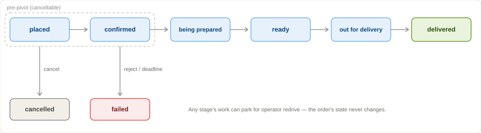

# Order Pipeline

Single-machine food-delivery pipeline: one Python package plus a Vite dashboard. Compose runs Postgres, the API, restaurant and courier sims, two workers, loadgen, and the SPA.



Longer notes: [design](https://app.notion.com/p/Design-Doc-Order-Pipeline-3bc2bade7f31815dac1ee7cb55bb6813?source=copy_link) · [demo runbook](https://app.notion.com/p/Demo-Runbook-3bc2bade7f31814da356f8f8c3d29a70?source=copy_link) · [easy wrong turns](https://app.notion.com/p/Easy-wrong-turns-3bd2bade7f3181118d66e60c508f8e1f?source=copy_link).

## Run

```bash
uv sync
docker compose down -v
docker compose up --wait
```

Open [http://127.0.0.1:5173/](http://127.0.0.1:5173/). The board is the live ops view; it polls `GET /snapshot` and does not need a refresh. **Presenter controls** in the header is the demo rail.

```bash
curl -sS -X POST http://localhost:8000/orders \
  -H 'Content-Type: application/json' \
  -H 'Idempotency-Key: diner-1' \
  -d '{"items":["chips"]}'
```

Menu is `chips` / `taco` / `burrito`, at most 3 items. The same `Idempotency-Key` and body replays the same order; a different cart under that key is `409`. The API accepts and stops. Workers confirm, cook, dispatch, and poll until `delivered`. Cancel is legal from `placed` and `confirmed`, and after `being_prepared` it is a counted `409`.

| Service | Port |
| --- | --- |
| Dashboard | [5173](http://127.0.0.1:5173/) |
| Order API | [8000](http://localhost:8000/health) · `GET /snapshot` |
| Restaurant sim | [8081](http://localhost:8081/health) |
| Courier sim | [8082](http://localhost:8082/health) |
| Loadgen | [8090](http://localhost:8090/health) |
| Postgres | `127.0.0.1:55432` (loopback only) |

Two worker replicas. Health stays inside the container (8083 is not published). Schema is one Alembic revision edited in place — `docker compose down -v` after pulling schema work. After image changes: `docker compose up --build --wait`.

## Load

The rail is the intended path. **`docker compose down -v && docker compose up --wait` is required before calibration** while simulator ledger pagination stays deferred: a fat restaurant ledger serializes accepts at tens of milliseconds and an H measured on that volume is not comparable to a fresh one.

Calibrate first so rush is sized to this machine; Normal can run on the fallback H, Rush cannot. Calibrate mints its own measurement cohort so leftover parked or stalled rows cannot pin `oldest_age_s` and walk the ramp to `h = 0`.

1. **Calibrate** — measures H, the highest rate whose waiting backlog stays flat. Status and the calibrate payload separately report offered requests, 201 accepted, door 429, other HTTP, and transport/timeout unknowns. A step with unresolved transport errors is not sustainable. If H is still 0 after a few steps the ramp aborts with a diagnostic instead of walking to `calibrate_max_rps`.
2. **New cohort** — isolates the demo walk from calibration traffic.
3. **01 Normal** — steady `0.4×H`. Follow one ticket through every stage.
4. **02 Rush** — 60s at `1.5×H`, then drain back to `0.4×H`. Drain means waiting backlog and oldest-age improve (sustained decline or back to the pre-rush baseline). Parking is shedding and is reported separately; it is not recovery. `POST /stop` waits for in-flight POSTs **and** cook/ride work to quiesce.

Same endpoints from the host:

```bash
curl -sS -X POST http://localhost:8090/calibrate
curl -sS -X POST http://localhost:8090/cohort/new
curl -sS -X POST http://localhost:8090/scenario/steady
curl -sS -X POST http://localhost:8090/scenario/rush
curl -sS -X POST http://localhost:8090/observe-drain
curl -sS -X POST http://localhost:8090/stop
```

Loadgen is open-loop: a door `429` is a counted reject, not a silent drop and not a generator slowdown. An ambiguous place-order timeout retries the same `Idempotency-Key` and body.

## Failures

Sims run an always-on 3% 5xx / 2% drop mix. Perform the rail's five cards in order — **01 Normal, 02 Rush, 03 Outage, 04 Worker crash, 05 Courier failure** — even if a longer runbook folds park/redrive into scenario 3.

**03 Outage.** **1 · Doom confirms** tags three orders that must fail confirm. **2 · Blackout** takes the restaurant down for 60s. In-flight work holds; the Restaurant chip reads Fault active. **Recover restaurant** clears it. Doomed orders fail at `accepted_at + 120s`; untagged ones resume.

**04 Worker crash.** **Arm visible lease**, open the Workers drawer, record an order and its owner hostname, then kill that replica from a terminal — the currently-leased card's hostname prefix, not `docker kill $(docker compose ps -q worker | head -1)` (that can hit the idle replica):

```bash
docker compose ps -q worker
docker kill <full-worker-id-whose-prefix-matches-the-visible-owner>
# Recover restaurant immediately after the kill, then:
docker compose up -d worker
```

The abandoned attempt stays `outcome IS NULL`. A survivor retries the same stored key. One applied confirm, no duplicate kitchen effect.

**Cancel race (rehearsal).** The bonus control places and cancels an order timed to collide with submit. Treat it as a rehearsal, not the proof: confirm completes in milliseconds, so a live click can land after `being_prepared`, return `409`, and increment `invalid_transitions`. The proof is `tests/test_cancel_race.py`, which holds confirm in-flight instead of racing a wall clock.

**05 Courier failure.** **Blackout courier · 30s** exhausts dispatch (budget 5). The order stays `ready`; the work item parks. **Recover courier**, then **Redrive** on that parked row — same work-item id and `(order_id, dispatch)` key, one courier-ledger effect. The dashboard Redrive button stays disabled while the fault is armed (`redriveBlocker` on Watch). `POST /work-items/{id}/redrive` still accepts a mid-fault redrive — the item becomes pending again and parks if the fault is still on; the crash-beat test depends on that.

Health while this runs: the three chips (Restaurant · Workers · Delivery), the correctness drawer, and `GET /snapshot`. The drawer leads with state vs last applied event, accepted orders with no work item, simulator-ledger duplicate effects (unavailable = unknown, never a silent pass), and parked / no-progress. Conservation residual is a partition of one `orders` SELECT (`in_flight` = not terminal); it cannot detect a lost insert. `GET /snapshot` reads those Postgres rows in one repeatable-read transaction. The Correctness card is red only when one of those independent checks is non-zero, amber-grey when a ledger is unavailable, and never red for parked work — parking is expected shedding with an owner and a next action.

## Cancel and the kitchen

Cancelling an order that the restaurant already accepted is partial success, and the two halves are tracked separately: the diner's book says `cancelled` and never resurrects, while the kitchen-side remainder is a `void_ticket` work item with its own retry budget. What that void does, and does not, do:

- **Accept starts service and decrements stock.** Stock is *consumed*, not restored on void — the kitchen already committed the ingredients. Restoring it would be a different product decision, not a correctness fix.
- **Void frees rail occupancy.** The pan reopens for the next ticket, which is the part that costs money.
- **Void is not an oven switch.** `GET /keys/(order, confirm)` still walks `queued → cooking → ready`. The void is a compensation record plus a rail release, recorded under its own key.
- **A void with nothing to compensate is a no-op, not an orphan.** The sim records `voided: false, absent: true` and replays it. Only an exhausted or permanently rejected void records an orphaned ticket on the correctness pane.

## Architecture

- One Python package (`order_pipeline`), one Python image. Restaurant, courier, worker, and loadgen are compose `command:`s. The dashboard is a separate Vite image.
- The API validates, persists, and returns. Place and cancel never call the sims. `GET /snapshot` is the one additive read the board polls (it does read both sim ledgers for duplicate-effects).
- Two FastAPI sims share one core (accept, poll, Stripe key cache, SQLite ledger, `/admin/faults`). Kitchen is 20 pans; courier is 8 bikes. Each 429s when the quoted wait is more than 3× that ticket's quiet time.
- Two workers on a plugin chassis (confirm, poll_cook, void_ticket, dispatch, poll_ride). Each cycle is claim → HTTP → finalize; there is no DB transaction across the outbound call. Claim and finalize run off the loop on *separate* thread pools, and the DB pool is sized to `WORKER_FINALIZE_WORKERS` plus headroom, so a stuck commit can neither starve the claim loop nor exhaust the connections `/health` needs. The first cook poll is scheduled at `service_started_at` (when the pan is due) so the 30-poll budget is not burned while the ticket sits on the rail; `estimated_ready_at` is the ready hint, not the first-poll time. Items already due wake together; the post-recovery stampede brake is dep-cap admission (`eligible_types`), not jitter on the due pile. Jitter applies to failed RETRY writes.
- Intake is a client `Idempotency-Key` plus a body fingerprint. Confirm/dispatch reuse a stored `(order_id, work)` key. Polls reuse the accept/dispatch ticket key, never a per-poll key. That stored key is the double-effect guarantee: a survivor retries the same key and the sim replays. `WORKER_LEASE_S > WORKER_SIM_TIMEOUT_S` is defence in depth so a live call is not stolen under shipped defaults — not because “a lease covers exactly one outbound call.”

## Decisions

- **Accept vs fulfill.** The API door (`API_ACCEPT_CONCURRENCY`) is a counted `429` with no order row. Kitchen/courier `429` means the order exists and the worker retries the same key. Mixing those two "busy" signals would hide the rush beat.
- **One commit for intake.** Order + `placed` event + confirm work item + place-key share a transaction, so an accepted order cannot exist without work (no silent drop at the door).
- **Place-key is identity, body is the conflict check.** Same key + same cart replays; same key + a different cart is `409`, not a merge. Safer than hashing the payload as the identity.
- **Confirm fails; later work parks.** Confirm is time-bounded (`accepted_at + 120s` → order `failed`). Poll/dispatch exhaust parks the work item, not the order. Park is not a lifecycle stage; Redrive is its only exit and keeps the stored key so a retry cannot mint a second sim effect.
- **Two keys on poll on purpose.** The work-item key is queue identity (`UNIQUE`). Using it as the sim HTTP key would duplicate effects on retry.
- **Double-effect is the stored key.** A survivor retries the same `(order_id, work)` key and the sim replays. `lease_s > sim_timeout_s` is defence in depth so a live call is not stolen under shipped defaults. The lease is still dropped after the outbound call so backoff stays unleased; that is occupancy, not the uniqueness proof.
- **`restart: "no"`.** `restart: always` would reap the abandoned NULL attempt that the worker-crash beat has to show. Two replicas so a survivor can resume.
- **Cancel is pre-pivot for the diner, post-accept for the kitchen.** The lifecycle allows cancel from `placed` and `confirmed`; after `being_prepared` it is evidence, not a state change. The restaurant is on a different clock: accept *starts service*, so a cancel from `confirmed` is already a cancel of food on a pan. Every way that can happen queues one `void_ticket` under `(order_id, void)` — cancel from `confirmed`, cancel superseding an in-flight confirm, and a confirm that crosses its 120s deadline. Cancel enqueues it itself instead of relying on the losing worker to survive and finalize; both paths take the order row lock first, so the unique key is a backstop rather than a 500.
- **One Alembic revision, Settings complete at first appearance.** Work types are `TEXT` + `CHECK`, not `ENUM`s, so `void_ticket` did not need `ALTER TYPE`. Growing Settings or the schema across slices would have been migration churn.

## Check

```bash
make check   # ruff + mypy + dashboard tsc + pytest
```

`make check` expects the live Compose stack: pytest talks to the published ports (API 8000, sims 8081/8082, loadgen 8090, dashboard 5173). Happy-path tests turn the mix off, then restore it.

Slow coverage (`@pytest.mark.slow`) is the long calibrate / rush / outage path on that stack:

- `tests/test_loadgen_compose.py::test_calibrate_reports_h_and_429_mix`
- `tests/test_dinner_rush_compose.py::test_scenario_0_steady_walk_and_scenario_1_rush`
- `tests/test_doom_confirm_compose.py` (outage fixture)
